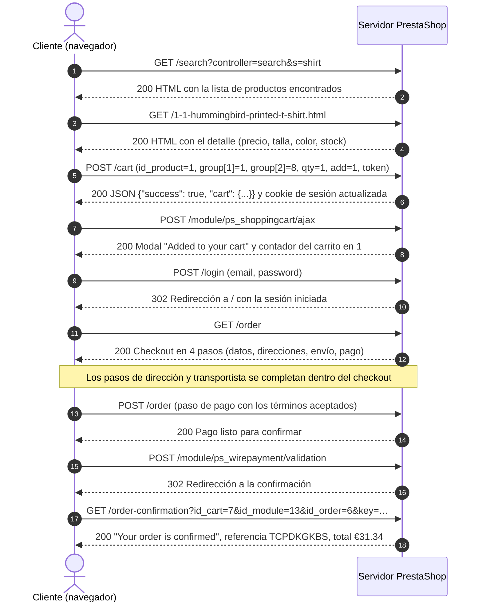

# Mapa de flujos críticos — PrestaShop

Primera parte del documento de casos de prueba (Semana 2).

| Aspecto | Detalle |
|---|---|
| Sistema bajo prueba | Demo oficial de PrestaShop 9.2.0 (https://demo.prestashop.com) |
| Instancia usada | `https://tasteful-carpenter.demo.prestashop.com` (la demo crea una instancia temporal por visita) |
| Fecha de la exploración | 07-oct-2026 |
| Navegador | Google Chrome 155 (escritorio), pestaña Network de DevTools |
| Autor | Dante Tárraga |

---

## 1. Diagrama cliente-servidor

**Flujo crítico elegido: comprar un producto** (desde el catálogo hasta la confirmación del pedido).

Es crítico porque el objetivo del sistema es vender: si este flujo falla, el cliente no puede comprar y la tienda no genera ingresos.



**Paso a paso**

| # | El cliente pide | El servidor responde |
|---|---|---|
| 1 | Buscar "shirt" | Página de resultados con "Hummingbird printed t-shirt" |
| 2 | Abrir el detalle del producto | Precio €22.94 (con 20 % de descuento sobre €28.68), variantes de talla y color |
| 3 | Agregar al carrito (talla S, color blanco, cantidad 1) | JSON con `success: true`, el carrito actualizado y `stock_quantity: 300` |
| 4 | Actualizar el mini carrito | Modal de confirmación y contador del carrito en 1 |
| 5 | Iniciar sesión | Redirección `302` a la página de inicio con la sesión iniciada |
| 6 | Ir al checkout | Formulario en 4 pasos con el resumen del pedido |
| 7 | Enviar dirección, transportista "My carrier" (€8.40) y pago por transferencia | Paso de pago con el total €31.34 |
| 8 | Confirmar el pedido | Valida el pago y redirige a la confirmación |
| 9 | Ver la confirmación | Pedido confirmado, referencia `TCPDKGKBS` y correo enviado al cliente |

---

## 2. Tabla de endpoints

Peticiones registradas con DevTools (pestaña Network, filtro Doc/Fetch/XHR) durante la exploración.

| # | Flujo | Acción | Método | Endpoint | Código de estado |
|---|---|---|---|---|---|
| 1 | Catálogo | Cargar la página de inicio | GET | `/` | 200 |
| 2 | Catálogo | Autocompletar la búsqueda mientras se escribe "mug" | POST | `/search` | 200 |
| 3 | Catálogo | Buscar "shirt" | GET | `/search?controller=search&s=shirt` | 200 |
| 4 | Catálogo | Ver el detalle de un producto | GET | `/1-1-hummingbird-printed-t-shirt.html` | 200 |
| 5 | Catálogo | Cargar las reseñas del producto | GET | `/module/productcomments/ListComments?id_product=1&page=1` | 200 |
| 6 | Carrito | Agregar un producto al carrito | POST | `/cart` | 200 |
| 7 | Carrito | Actualizar el mini carrito | POST | `/module/ps_shoppingcart/ajax` | 200 |
| 8 | Registro | Crear cuenta con un email inválido (`correo-invalido`) | POST | `/registration` | 200 (muestra "Invalid format.") |
| 9 | Registro | Crear cuenta con datos válidos | POST | `/registration` | 302 |
| 10 | Login | Iniciar sesión con contraseña incorrecta | POST | `/login` | 200 (muestra "Authentication failed.") |
| 11 | Login | Iniciar sesión con datos correctos | POST | `/login` | 302 |
| 12 | Check Out | Abrir el checkout | GET | `/order` | 200 |
| 13 | Check Out | Enviar el paso de pago con los términos aceptados | POST | `/order` | 200 |
| 14 | Check Out | Validar el pago por transferencia | POST | `/module/ps_wirepayment/validation` | 302 |
| 15 | Check Out | Ver la confirmación del pedido | GET | `/order-confirmation?id_cart=7&id_module=13&id_order=6&key=…` | 200 |

**Observaciones para diseñar los casos**

- **Los errores de validación responden `200`, no `4xx`.** El email inválido y el login fallido devuelven la misma página con un mensaje de error. Los casos deben verificar el mensaje en pantalla, no solo el código de estado.
- **Las acciones correctas responden `302`.** El registro, el login y la validación del pago redirigen a la página siguiente.
- **El carrito usa un token** (`token=…`) en cada `POST /cart`, además de la cookie de sesión.
- **Al cerrar sesión se vacía el carrito.** El producto agregado como visitante no se conserva después del logout. Hay que confirmar si es el comportamiento esperado antes de reportarlo.
- **La instancia es temporal.** Mientras la página de lanzamiento de la demo estuvo cerrada, la instancia `young-card.demo.prestashop.com` empezó a responder `502 Bad gateway` en todas sus páginas. No es un defecto de PrestaShop: es el ciclo de vida de la demo. Hay que mantener abierta la pestaña de demo.prestashop.com durante la sesión.

---

## 3. Plantilla de caso de prueba

### Clase `CasoDePrueba` (pseudocódigo)

```text
CLASE CasoDePrueba
    ATRIBUTOS
        id                  : Texto        // CP-<módulo>-<número>, por ejemplo CP-M05-001
        titulo              : Texto        // Qué se verifica, en una frase
        modulo              : Texto        // M01 a M05 del documento de alcance
        requisito           : Texto        // Requisito al que se vincula (matriz de trazabilidad)
        prioridad           : Alta | Media | Baja
        tipoPrueba          : Funcional | Exploratoria | Usabilidad | Regresión
        nivel               : Integración | Sistema | Aceptación
        tecnica             : Partición de equivalencia | Valores límite | Flujo | Error guessing
        precondiciones      : Lista<Texto>
        datosDePrueba       : Mapa<Texto, Texto>
        pasos               : Lista<Paso>  // Cada paso: número, acción, dato
        resultadoEsperado   : Texto
        resultadoObtenido   : Texto
        estado              : No ejecutado | Pasó | Falló | Bloqueado
        severidad           : Crítica | Alta | Media | Baja | Ninguna   // Solo si falló
        defectoAsociado     : Texto        // Id del reporte de defecto, si falló
        evidencia           : Lista<Texto> // Rutas a capturas o grabaciones
        ambiente            : Texto        // URL de la instancia y navegador
        autor               : Texto
        fechaEjecucion      : Fecha

    MÉTODOS
        ejecutar(resultadoObtenido, evidencia)
            this.resultadoObtenido = resultadoObtenido
            this.evidencia = evidencia
            this.fechaEjecucion = hoy()
            SI resultadoObtenido coincide con resultadoEsperado
                this.estado = "Pasó"
            SINO
                this.estado = "Falló"

        vincularDefecto(idDefecto, severidad)
            this.defectoAsociado = idDefecto
            this.severidad = severidad

        estaListoParaEjecutar() : Booleano
            RETORNAR precondiciones no está vacío Y pasos no está vacío Y resultadoEsperado no está vacío
FIN CLASE
```

### Objeto de ejemplo

```text
casoCompra = NUEVO CasoDePrueba(
    id                = "CP-M05-001",
    titulo            = "Completar una compra con pago por transferencia bancaria",
    modulo            = "M05 Check Out",
    requisito         = "RF-05: El cliente puede pagar y confirmar su pedido",
    prioridad         = "Alta",
    tipoPrueba        = "Funcional",
    nivel             = "Sistema",
    tecnica           = "Flujo",
    precondiciones    = [
        "La instancia de la demo está activa",
        "El cliente tiene una cuenta registrada y la sesión iniciada",
        "El carrito tiene 1 unidad de 'Hummingbird printed t-shirt' talla S, color blanco"
    ],
    datosDePrueba     = {
        "Dirección": "10 Rue de Rivoli",
        "Código postal": "75001",
        "Ciudad": "Paris",
        "País": "France",
        "Transportista": "My carrier",
        "Pago": "Pay by bank wire"
    },
    pasos             = [
        Paso(1, "Ir al checkout desde el carrito", ""),
        Paso(2, "Completar la dirección y pulsar Continue", "Datos de la dirección"),
        Paso(3, "Elegir el transportista y continuar al pago", "My carrier"),
        Paso(4, "Elegir el método de pago y aceptar los términos", "Pay by bank wire"),
        Paso(5, "Pulsar Place Order", "")
    ],
    resultadoEsperado = "Se muestra 'Your order is confirmed' con una referencia de pedido y el total €31.34 (subtotal €22.94 + envío €8.40)",
    resultadoObtenido = "Se mostró 'Your order is confirmed', referencia TCPDKGKBS, total €31.34",
    estado            = "Pasó",
    severidad         = "Ninguna",
    defectoAsociado   = "",
    evidencia         = [],
    ambiente          = "https://tasteful-carpenter.demo.prestashop.com — Chrome 155 (escritorio)",
    autor             = "Dante Tárraga",
    fechaEjecucion    = 07-oct-2026
)
```

Los atributos de la clase son los campos del documento de casos de prueba que se diseña en la sesión 5.
